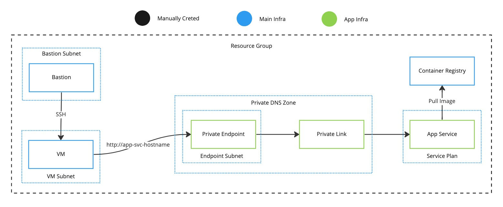

# Intro

**TODO**

# Create TF State Storage Account

**TODO**: `infra/main/build_tfstate_blob.sh`

# Run Main Infra

**TODO**: `infra/main`

# Configure Jenkins Secrets

**TODO**

# Create Jenkins Pipeline

**TODO**: `cicd/Jenkinsfile`

# Deploy the App Services

**TODO**

# Tear Down the App Services

**TODO**
